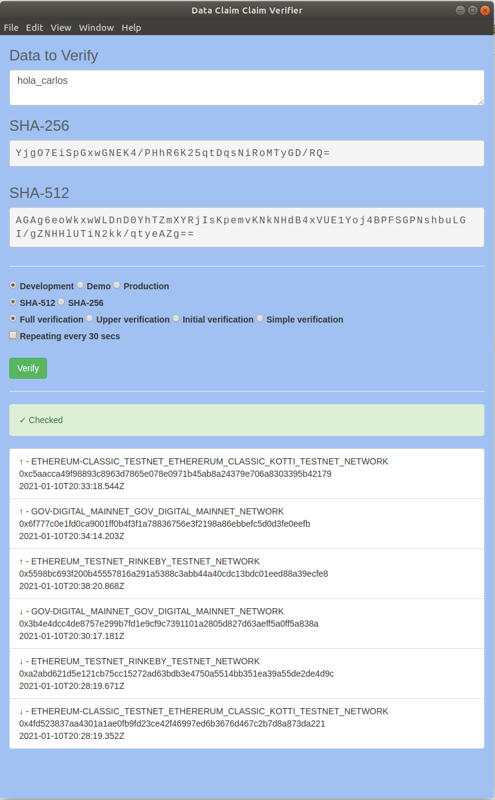
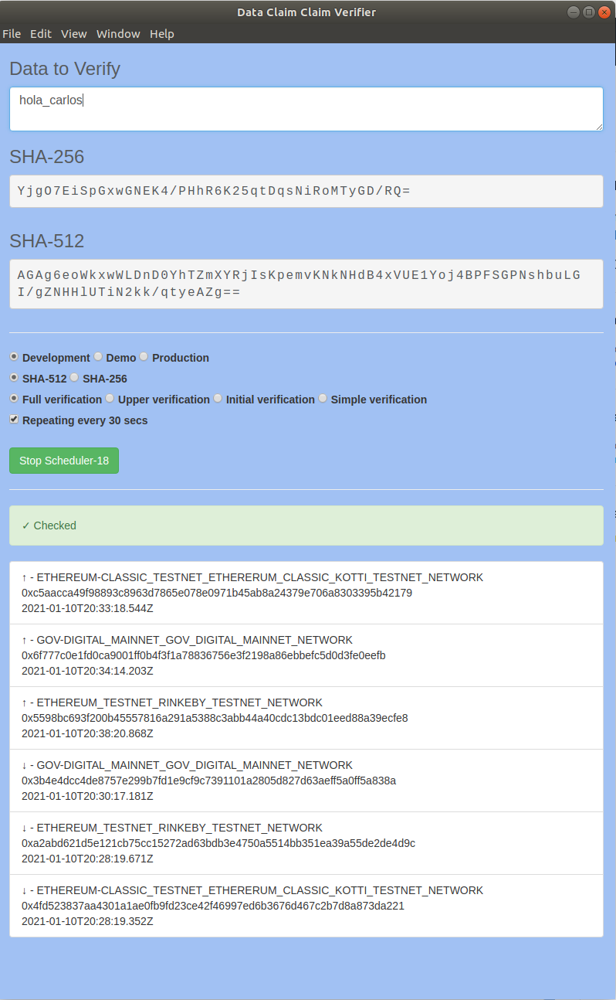

# Data Claims Verifier

Simple e-app that allows verifying data claims against the Ubirch Trust Service.

## How to run it

- Install [Node LTS](https://nodejs.org)
- Clone this repository
- `cd` into the repo  
- `npm install` to install the application's dependencies
- `npm start` to start the application

## Ideas to add

- A scheduler to query for not yet anchored data claims until found.
- Manage app from tray app.
